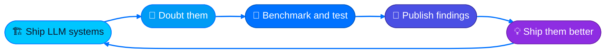

<div align="center">

### 👨‍💻 Mohammad Mahdi Mohajer

*Senior ML Engineer, [LRQA](https://www.lrqa.com/) · ML × SE Researcher · Toronto, Canada 🇨🇦*


[](https://scholar.google.ca/citations?user=GtTTkj0AAAAJ&hl=en)
[](https://scholar.google.ca/citations?user=GtTTkj0AAAAJ&hl=en)

</div>

> 🧾 **Abstract.** This profile documents a long-running case study of one senior AI engineer with an unusual dual condition. By day, the subject ships production LLM systems. By night, he publishes peer-reviewed research asking whether those systems work as well as everyone claims. Symptoms include a decade of full-stack engineering, a growing publication record in software engineering venues, and a stubborn refusal to accept *"it looks fine"* as an evaluation method. The two conditions turn out to help each other: each one treats the failure modes of the other. The condition is stable, productive, and shows no exit criteria (see Fig. 1).

**🏷️ Index Terms:** `large language models` · `software testing` · `benchmarking` · `program analysis` · `production ML systems`


## 1️⃣ Introduction

Most engineers **ship** AI systems. Most researchers **doubt** them. I do both, and I'm convinced neither works without the other.

At **LRQA** 🏗️ I build everything around the model: retrieval, evaluation pipelines, and the full-stack product that turns an LLM into something people can rely on. On the research side 🔬, I build benchmarks and testing methods that check whether any of it actually holds up, including work on how well LLMs handle real-world software engineering tasks.



<div align="center"><sub><b>Figure 1.</b> The subject's core feedback loop. No exit condition has been observed.</sub></div>

## 2️⃣ Related Work

The subject's peer-reviewed work covers benchmarks for LLM coding ability, testing methods for deep learning libraries, and LLM-driven program analysis. The full record is archived in [[3]](#references) 📚. His industry track record is documented separately in [[2]](#references) 💼.

## 3️⃣ Apparatus — the stack 🧰

**🧠 ML & LLMs:** model training, evaluation, and everything needed to trust the outputs


**🖥️ Product & Backend:** because a model without a product around it is just a demo


**☁️ Infra & Data:** keeping things alive in production, where "it worked on my machine" goes to die


**⚗️ Evaluation criterion:** every claim gets a benchmark and every system gets a test. Vibes are not a metric.

## 4️⃣ Threats to Validity

⚠️ This README was written by the subject himself. Independent replication is encouraged: read the papers [[3]](#references) 📄, run the [code](https://github.com/mmohajer9?tab=repositories) 💻, or email him [[5]](#references) ✉️ and draw your own conclusions.

## References

| # | Directory | Contents |
|---|---|---|
| [1] | 🌐 **[mamad.ai](https://mamad.ai/)** | The subject's homepage |
| [2] | 💼 **[LinkedIn](https://www.linkedin.com/in/mmohajer9/)** | Industry track record, independently documented |
| [3] | 📚 **[Google Scholar](https://scholar.google.ca/citations?user=GtTTkj0AAAAJ&hl=en)** | Peer-reviewed publications, fully archived |
| [4] | 🧩 **[Stack Overflow](https://stackoverflow.com/users/9091011)** | Answers left in the wild |
| [5] | ✉️ **[contact@mamad.ai](mailto:contact@mamad.ai)** | Correspondence. Hard problems preferred |

## 📖 How to Cite

```bibtex
@misc{mohajer2026,
  author  = {Mohajer, Mohammad Mahdi},
  title   = {Available for interesting problems in LLM systems and SE research},
  contact = {contact@mamad.ai},
  url     = {https://mamad.ai},
  note    = {Toronto, Canada. Responds faster to hard problems than easy ones.}
}
```

## 🙏 Acknowledgments

This research was supported by **coffee** ☕. Grants are accepted via:

<a href="https://www.buymeacoffee.com/mmohajer9"></a>
&nbsp;
<a href="https://ko-fi.com/mmohajer9"></a>


