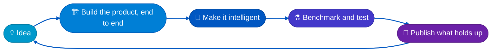

<div align="center">

### 👨‍💻 Senior ML/Software Engineer @ [LRQA](https://www.lrqa.com/)

*ML × SE Researcher · Full-Stack at Heart · Toronto, Canada 🇨🇦*

<sub>\* First name Mohammad Mahdi, last name Mohajer. Also answers to **Mo** and **Mamad**. Yes, that explains the domain name.</sub>

</div>

> 🧾 **Abstract.** This profile documents Mohammad Mahdi Mohajer, an engineer with a rare dual expertise. He spent years as a senior full-stack software engineer before becoming a senior ML/AI engineer, and he kept both skill sets sharp. He can take a product from first commit to production, and he can make the intelligent parts of it genuinely intelligent. He also publishes peer-reviewed research asking whether AI systems work as well as everyone claims, and shows persistent founder symptoms: ideas keep turning into products. The condition is stable, productive, and shows no exit criteria (see Fig. 1).

**🏷️ Index Terms:** `full-stack engineering` · `large language models` · `software testing` · `benchmarking` · `program analysis` · `production ML systems`


## 1️⃣ Introduction

Most engineers **ship** AI systems. Most researchers **doubt** them. I do both, and I'm convinced neither works without the other.

I spent years as a senior full-stack software engineer before moving into ML and AI, and I never put the first toolbox down. That mix is rarer than it should be: I can design the intelligent core of a system 🧠 and also build the entire product around it, end to end 🏗️. My work spans production AI systems, the engineering that keeps them reliable, and research 🔬 on how to evaluate them honestly.



<div align="center"><sub><b>Figure 1.</b> Mohammad's operating loop, from idea to product to proof. No exit condition has been observed.</sub></div>

## 2️⃣ Related Work

Mohammad's peer-reviewed work covers benchmarks for LLM coding ability, testing methods for deep learning libraries, and LLM-driven program analysis. The full record is archived in [[3]](#references) 📚. His industry track record is documented separately in [[2]](#references) 💼.

## 3️⃣ Apparatus: The Stack 🧰

**🧠 ML & LLMs:** model training, evaluation, and everything needed to trust the outputs


**🖥️ Product & Backend:** because a model without a product around it is just a demo


**☁️ Infra & Data:** keeping things alive in production, where "it worked on my machine" goes to die


**⚗️ Evaluation criterion:** every claim gets a benchmark and every system gets a test. Vibes are not a metric.

## 4️⃣ Threats to Validity

⚠️ This README was written by Mohammad himself. Independent replication is encouraged: read the papers [[3]](#references) 📄, run the [code](https://github.com/mmohajer9?tab=repositories) 💻, or email him [[5]](#references) ✉️ and draw your own conclusions.

## References

| # | Directory | Contents |
|---|---|---|
| [1] | 🌐 **[mamad.ai](https://mamad.ai/)** | Mohammad's homepage |
| [2] | 💼 **[LinkedIn](https://www.linkedin.com/in/mmohajer9/)** | Industry track record, independently documented |
| [3] | 📚 **[Google Scholar](https://scholar.google.ca/citations?user=GtTTkj0AAAAJ&hl=en)** | Peer-reviewed publications, fully archived |
| [4] | 🧩 **[Stack Overflow](https://stackoverflow.com/users/9091011)** | Answers left in the wild |
| [5] | ✉️ **[contact@mamad.ai](mailto:contact@mamad.ai)** | Correspondence. Hard problems preferred |

## 📖 How to Cite

```bibtex
@misc{mohajer,
  author  = {Mohajer, Mohammad Mahdi},
  title   = {Available for interesting problems in LLM systems and SE research},
  contact = {contact@mamad.ai},
  url     = {https://mamad.ai},
  note    = {Toronto, Canada. Responds faster to hard problems than easy ones.}
}
```

## 🙏 Acknowledgments

This research was supported by **coffee** ☕. Grants are accepted via:

<a href="https://www.buymeacoffee.com/mmohajer9"></a>
&nbsp;
<a href="https://ko-fi.com/mmohajer9"></a>


