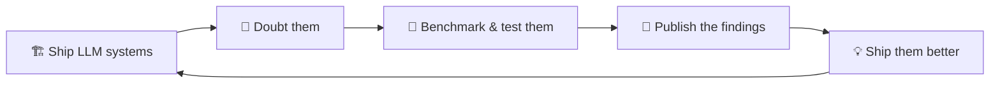

<div align="center">

### 👨‍💻 Mohammad Mahdi Mohajer

*Senior ML Engineer, [LRQA](https://www.lrqa.com/) · ML × SE Researcher · Toronto, Canada 🇨🇦*


[](https://mamad.ai/)
[](https://scholar.google.ca/citations?user=GtTTkj0AAAAJ&hl=en)
[](https://www.linkedin.com/in/mmohajer9/)
[](mailto:contact@mamad.ai)

</div>

> 🧾 **Abstract** — This profile reports a longitudinal case study of a senior AI engineer presenting a rare dual condition: by day, the subject ships production-grade LLM systems; by night, he publishes peer-reviewed research questioning whether such systems work as well as everyone claims. Symptoms include a decade of full-stack engineering, a growing publication record in top software engineering venues, and a chronic inability to accept *"it looks fine"* as an evaluation method. Findings indicate the two conditions are not in conflict — each is the treatment for the other's failure modes. The condition is stable, productive, and (see Fig. 1) shows no exit criteria.

**🏷️ Index Terms** — `large language models` · `software testing` · `benchmarking` · `program analysis` · `production ML systems`


## 1️⃣ Introduction

Most engineers **ship** AI systems. Most researchers **doubt** them. I do both — and I'm convinced neither works without the other.

At **[LRQA](https://www.lrqa.com/)** 🏗️ I build what surrounds the model: the retrieval, the evaluation pipelines, and the full-stack product that turns an LLM into something people can rely on. In my research life 🔬, I build the benchmarks and testing methods that check whether any of it actually holds up — including work on evaluating LLMs against real-world software engineering tasks.



<div align="center"><sub><b>Figure 1.</b> The subject's core feedback loop. No exit condition has been observed.</sub></div>

## 2️⃣ Related Work

The subject's peer-reviewed record — benchmarks for LLM coding abilities, testing methods for deep learning libraries, and LLM-driven program analysis — is fully archived and independently verifiable:

<div align="center">

[](https://scholar.google.ca/citations?user=GtTTkj0AAAAJ&hl=en)
[](https://scholar.google.ca/citations?user=GtTTkj0AAAAJ&hl=en)
[](https://www.linkedin.com/in/mmohajer9/)

</div>

## 3️⃣ Systems & Artifacts

- 🎬 **[video-to-ui](https://github.com/mmohajer9/video-to-ui)** — a Claude Code skill that turns a UI screen recording into design data, code edits, or a runnable React scaffold
- 🌐 **[RESTester](https://github.com/mmohajer9/RESTester)** — automatic black-box test-case generator for RESTful APIs (+ its [Testing-as-a-Service backend](https://github.com/mmohajer9/RESTester-TaaS))
- 📏 **[pyccmetrics](https://github.com/mmohajer9/pyccmetrics)** — Python package for code-complexity metrics

## 4️⃣ Methodology

<div align="center">
  
</div>

> ⚗️ **Evaluation criterion:** if it isn't tested, it doesn't work — it just hasn't failed yet.

## 5️⃣ Threats to Validity

⚠️ This README was written by the subject himself. Independent replication is strongly encouraged: read the [papers](https://scholar.google.ca/citations?user=GtTTkj0AAAAJ&hl=en) 📄, run the [code](https://github.com/mmohajer9?tab=repositories) 💻, or [email him](mailto:contact@mamad.ai) ✉️ and reach your own conclusions.

## 📖 How to Cite

```bibtex
@misc{mohajer2026,
  author  = {Mohajer, Mohammad Mahdi},
  title   = {Available for interesting problems in LLM systems and SE research},
  contact = {contact@mamad.ai},
  url     = {https://mamad.ai},
  note    = {Toronto, Canada. Responds faster to hard problems than easy ones.}
}
```

## 🙏 Acknowledgments

This research was supported by **coffee** ☕. Grants are accepted via:

<a href="https://www.buymeacoffee.com/mmohajer9"></a>
&nbsp;
<a href="https://ko-fi.com/mmohajer9"></a>


